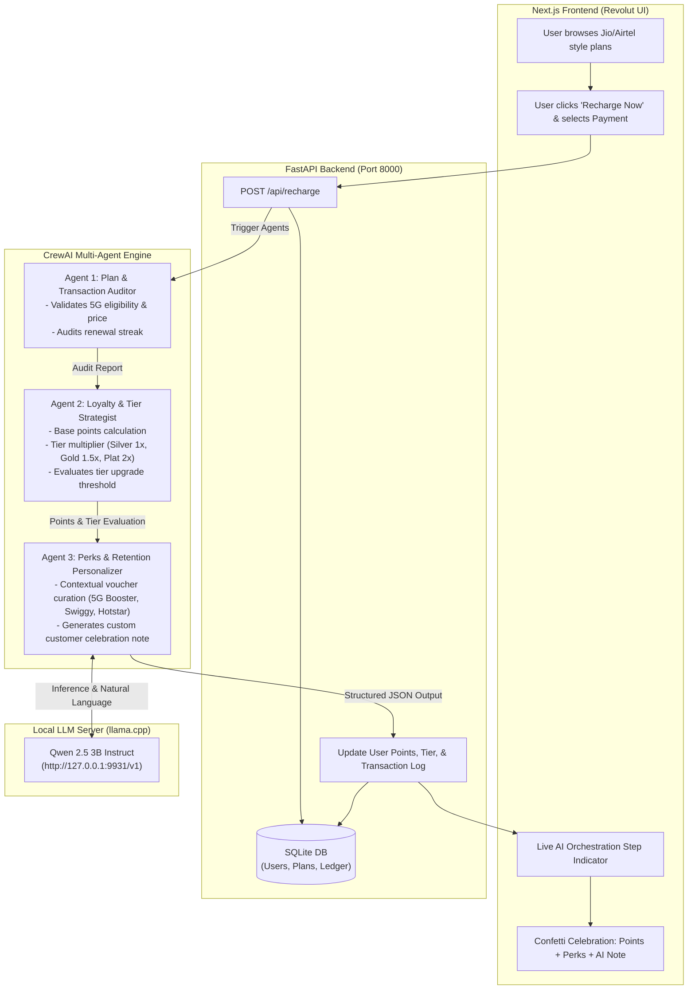

<!-- Section from: c:\Users\Sahil\Desktop\TechM\README.md | Lines: 7-48 -->

## End-to-End Agentic Flow Architecture

```mermaid
flowchart TD
    subgraph Client["Next.js Frontend (Revolut UI)"]
        UI_A["User browses Jio/Airtel style plans"]
        UI_B["User clicks 'Recharge Now' & selects Payment"]
        UI_C["Live AI Orchestration Step Indicator"]
        UI_D["Confetti Celebration: Points + Perks + AI Note"]
    end

    subgraph Backend["FastAPI Backend (Port 8000)"]
        API_A["POST /api/recharge"]
        DB[("SQLite DB\n(Users, Plans, Ledger)")]
        API_B["Update User Points, Tier, & Transaction Log"]
    end

    subgraph CrewAI["CrewAI Multi-Agent Engine"]
        Agent1["Agent 1: Plan & Transaction Auditor\n- Validates 5G eligibility & price\n- Audits renewal streak"]
        Agent2["Agent 2: Loyalty & Tier Strategist\n- Base points calculation\n- Tier multiplier (Silver 1x, Gold 1.5x, Plat 2x)\n- Evaluates tier upgrade threshold"]
        Agent3["Agent 3: Perks & Retention Personalizer\n- Contextual voucher curation (5G Booster, Swiggy, Hotstar)\n- Generates custom customer celebration note"]
    end

    subgraph LLM["Local LLM Server (llama.cpp)"]
        Qwen["Qwen 2.5 3B Instruct\n(http://127.0.0.1:9931/v1)"]
    end

    UI_A --> UI_B
    UI_B --> API_A
    API_A --> DB
    API_A -->|Trigger Agents| Agent1
    Agent1 -->|Audit Report| Agent2
    Agent2 -->|Points & Tier Evaluation| Agent3
    Agent3 <-->|Inference & Natural Language| Qwen
    Agent3 -->|Structured JSON Output| API_B
    API_B --> DB
    API_B --> UI_C
    UI_C --> UI_D
```

---
